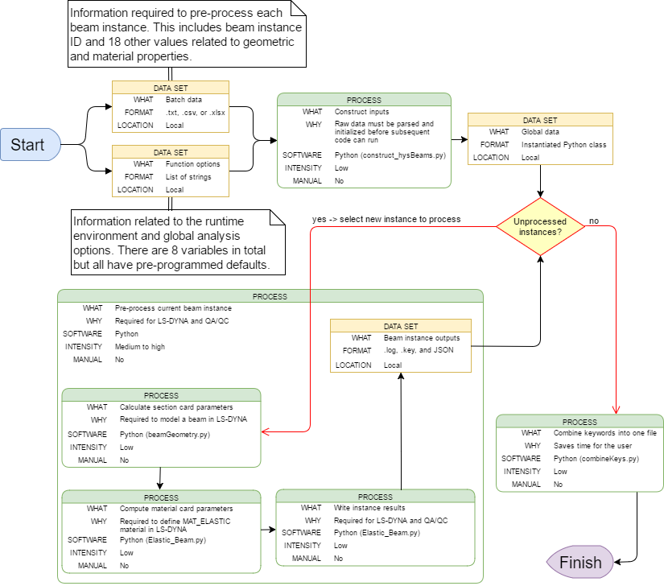

# Automated generation of MAT_ELASTIC material and beam section cards for LS-DYNA

This tool facilitates batch mode pre-processing of elastic beam section and 
material cards for LS-DYNA. The associated material formulation is known as 
MAT_ELASTIC [(LS-DYNA documentation)](Resources/LS-DYNA_manual_Vol2.pdf)

<p>Developer: @Kevin.Stanton</p>


## Prerequisites

Required:
* Python 3
    
## Usage

1. Install with pip <br />
`pip install git+https://github.com/mottmacdonaldglobal/mmodpy`
2. Import the library <br />
`import mmodpy.beams as beams`
3. Run the MAT_ELASTIC function <br />
`beams.MAT_ELASTIC([options])`

## Workflow


## Options    

```python
def MAT_ELASTIC(
        batchMode=False,
        iSet=1,
        pInputs=os.path.join(os.getcwd(), 'inputs_elasticBeams.xlsx'),
        pSave=os.path.join(os.getcwd(), 'Output_elasticBeams'),
        tbOption='default',
        author='user',
        company='Arup',
        job_name='dev',
        write_log=False):
    '''
    This function writes MAT_ELASTIC and section cards for LS-DYNA beam
    elements.

    @author: kevin.stanton

    Parameters
    ----------
    batchMode : bool
        Batch mode option ('on' or 'off')
        Default = False -> results only returned for the given iSet
    iSet : int
        Input set for a single analysis (ignored if batchMode = 'on')
    pInputs : str
        Input file path (.txt, .csv, or .xlsx)
        Default = os.getcwd() + '\\inputs.xlsx'
        Extra values/blank lines are automatically ignored
        May alternatively be defined as a list of strings in lieu of all other
        arguments
    pSave : str
        Option to specify a different file path to write results
        Default = os.getcwd() + '\\Output_elasticBeams'
        Specified folder will be tagged with current date/time
    tbOption : str
        Treatment of T-Beams ('default' or 'in-slab')
        'in-slab' -> density_reduced = density*(Area_eff/Area_total)
    author : str
        Name of author
        Default = 'user'
    company : str
        Company name
        Default = 'Arup'
    job_name : str
        Project name
        Default = 'dev'
    write_log : bool
        Option to write the contents of the terminal to a log file
        Default = False

    Returns
    -------
    Beam-RC_Beam_[ID].key : file(s)
        An LS-DYNA keyword file is written to the output directory for each 
        beam analyzed
        Includes section and material card data
    autobeams.key : file
        LS-DYNA keyword containing all batch results in one file is written to 
        the output directory
    jsonData : str
        Contents of Beam-RC_Beam_[ID].key written in JSON format
    elasticBeams.log : file (optional)
        The console output is written to a log file the pSave directory stamped
        with the analysis start date/time
        Not written if write_log = False
        '''
```
