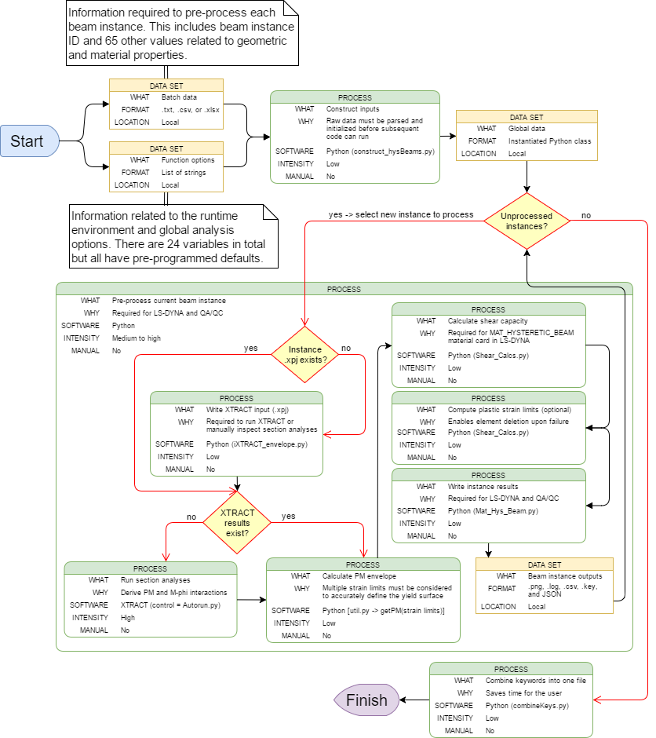

# Automated generation of MAT_HYSTERETIC_BEAM cards for LS-DYNA

This tool facilitates batch pre-processing of beam material and section cards 
for LS-DYNA. It implements a resultant beam formulation known as 
MAT_HYSTERETIC_BEAM [(LS-DYNA documentation)](Resources/MAT_HYSTERETIC_BEAM.pdf),
which enables simulation of reinforced concrete beams.

<p>Developer: @Kevin.Stanton</p>


## Prerequisites

Required:
* Windows 7 or later
* Working XTRACT.exe (v3.08)
* Python 3
* autopy3
	- [Documentation](https://github.com/Riamse/autopy3)
	- [Installation file](Resources/autopy3-0.51.1-cp37-cp37m-win_amd64.whl)

## Usage

1. Install with pip <br />
`pip install git+https://github.com/mottmacdonaldglobal/mmodpy`
2. Import the library <br />
`import mmodpy.beams as beams`
3. Run the MAT_HYSTERETIC_BEAM function <br />
`beams.MAT_HYSTERETIC_BEAM([options])`

## Workflow


## Options    

```python
def MAT_HYSTERETIC_BEAM(
        batchMode=False,
        iSet=1,
        pInputs=os.path.join(os.getcwd(),'inputs_hysBeams.xlsx'),
        pSave=os.path.join(os.getcwd(),'Output_hysBeams'),
        codeOption='EC2',
        concreteFactor='normal',
        fParams='ASCE 41-17',
        tbOption='default',
        concrete_strain_limits=[
            0.0012,
            0.0024,
            0.0035],
        steel_strain_limits=[
            1.0,
            1.5],
        npoints=401,
        mphisolution='BiSection',
        bilinearflag=False,
        cLimits='explicit',
        cleanCurves=True,
        skipFlag=True,
        pXTRACT=r'C:\Program Files (x86)\TRC\XTRACT\XTRACT.exe',
        mInter=False,
        timingControl='automatic',
        controlMode='default',
        author='user',
        company='Arup',
        job_name='dev',
        showPlots=True,
        write_log=False,
        user_xpj=False,
        settings_path=''):
    '''
    This function writes MAT_HYSTERETIC_BEAM cards for LS-DYNA. DO NOT TOUCH
    THE MOUSE WHILE CODE IS RUNNING unless the manual intervention option is
    enabled.

    @author: kevin.stanton

    Parameters
    ----------
    batchMode : bool
        Batch mode option
        Default = False -> results only returned for the given iSet
    iSet : int
        Input set for a single analysis (ignored if batchMode = 'on')
    pInputs : str
        Input file path (.txt, .csv, or .xlsx)
        Default = cwd\inputs_hysBeams.xlsx
        Extra values/blank lines are automatically ignored
    pSave : str
        Option to specify a different file path to write results
        Default = cwd\Output_hysBeams
        Specified folder will be tagged with current date/time
    codeOption : str
        'EC2' for Eurocode 2 [default]
        'CSA' for Canadian Standards Association (CSA A23.3-14)
    concreteFactor : str
        Factor to account for lightweight aggregate concrete (or not)
        Only applicable to CSA (known as parameter lambda)
        'normal' (lamda=1) [default]; 'semi-light' (lambda=0.85); or 'light'
        (lambda=0.75)
    fParams : str or bool
        Options to compute/write plastic rotation thresholds
        Valid arguments = 'ASCE 41-17' (default), 'ASCE 41-13', or False
        If False, no element deletion will take place
        PRSi/PRTi = 0 if required input data is missing
    tbOption : str
        Treatment of T-Beams ('default' or 'in-slab')
        'in-slab' -> density_reduced = density*(Area_eff/Area_total)
    concrete_strain_limits : list of floats
        Limiting concrete strains for enveloping PM curve
        For more refined analyses use:
            [0.0012,0.0015,0.0018,0.0021,0.0024,0.0027,0.003,0.0033,0.0035]
        ASCE 41-17, Section 10.3.3.1 [Usable Strain Limits]:
            [0.002,0.003]
    steel_strain_limits : list of floats
        Limiting steel strains for enveloping PM curve
        Defined as: (yield stress / Young's modulus) x steel_strain_limits[i]
        default = [1.0, 1.5, 2.0]
    npoints : int
        Number of points desired on the final, enveloped PM curve
        Default = 401
    mphisolution : str
        Solution method for moment curvature plot
        default = 'BiSection'
        'MUDN' -> iteration at Minimum Unbalanced Displacement Norm
    bilinearflag : bool
        Flag to use bi-linearized moment curvature data in LS-DYNA
        Default = False
    cLimits : str
        Yield moment interpretation ('strict', 'flex', 'explicit')
        'strict' and 'flex' are ML methods
        'explicit' (default) is based on checking developed strains against
        user-defined limits
    cleanCurves:
        Flag to write smoothed moment curvature data to LS-DYNA
        default = True
    skipFlag : True
        Flag to skip XTRACT analysis if appropriate data already exists
        Relevant data must be saved in working directory ([ID].txt files)
        Default = True
    pXTRACT : str
        XTRACT path
        default = r'C:\Program Files (x86)\TRC\XTRACT\XTRACT.exe'
        The code automatically checks the os for XTRACT but sometimes
        environment settings force the path to be defined explicitely
    mIter : bool
        Option to enable manual intervention mode for XTRACT analysis
        Default = False
    timingControl : str
        Toggle for automatic (CPU-based) analysis timing or fixed timing.
        Acceptable arguments:
            'automatic' -> CPU usage based analysis timing [default]
            'fixed' -> fixed analysis time from 'settings.py'
    controlMode : str
        Mouse movement control options ('default' or 'mod1')
        If 'default' causes an error, try 'mod1'
    author : str
        Name of author
        Default = 'user'
    company : str
        Company name
        Default = 'Arup'
    job_name : str
        Project name
        Default = 'dev'
    showPlots : bool
        Show XTRACT plots when running section analysis (True or False)
        May run faster if 'False'
        Default = True
    write_log : bool
        Option to write the contents of the terminal to a log file
        Default = False
    user_xpj : bool
        Option to use a user-defined .xpj to run XTRACT
        File name must match info_filename for given iSet and file must be 
        stored in the cwd
	settings_path : str
        Path to settings file for user-defined mouse click positions
        Default setting used if unspecified

    Returns
    -------
    Beam-RC_Beam_[ID].key : file(s)
        LS-DYNA keyword file is written for each beam instance
        Includes section and material card data
    autobeams.key : file
        LS-DYNA keyword containing all batch results in one file
    [ID].txt : file
        A text file containing the raw XTRACT output is saved for each 
        beam instance
    M_phi_xx_[ID].png, M_phi_yy_[ID].png : files
        Images of the interpretted moment-curvature plots for both loading 
        directions are saved each beam instance
    Moment_Curvature_[ID].csv : file
        Processed moment curvature data for beam instance [ID]
    Moment_Curvature_RAW_[ID].csv : file
        Raw moment curvature data for beam instance [ID]
    Moment_Interaction_[ID].csv : file
        Axial load-moment interaction data for beam instance [ID]
        Applies to last entries in steel and concrete strain limit lists
    Moment_Interaction[ID].csv : file
        Axial load-moment interaction data for beam instance [ID]
        Includes all results for the different steel and concrete strain limits
    Moment_Interaction_Envelope[ID].csv : file
        Enveloped axial load-moment interaction data for beam instance [ID]
    Moment_Plastic_Rotation_[ID].csv : file
        Moment-plastic rotation interaction data for beam instance [ID]
    PMxx[ID].csv, PMyy[ID].csv : file
        Enveloped axial load-moment interaction data for beam instance [ID]
    jsonData : str
        Contents of Beam-RC_Beam_[ID].key written in JSON format
    hysBeams.log : file (optional)
        The console output written to a log file
        Not written if write_log = False
    '''
```
    
